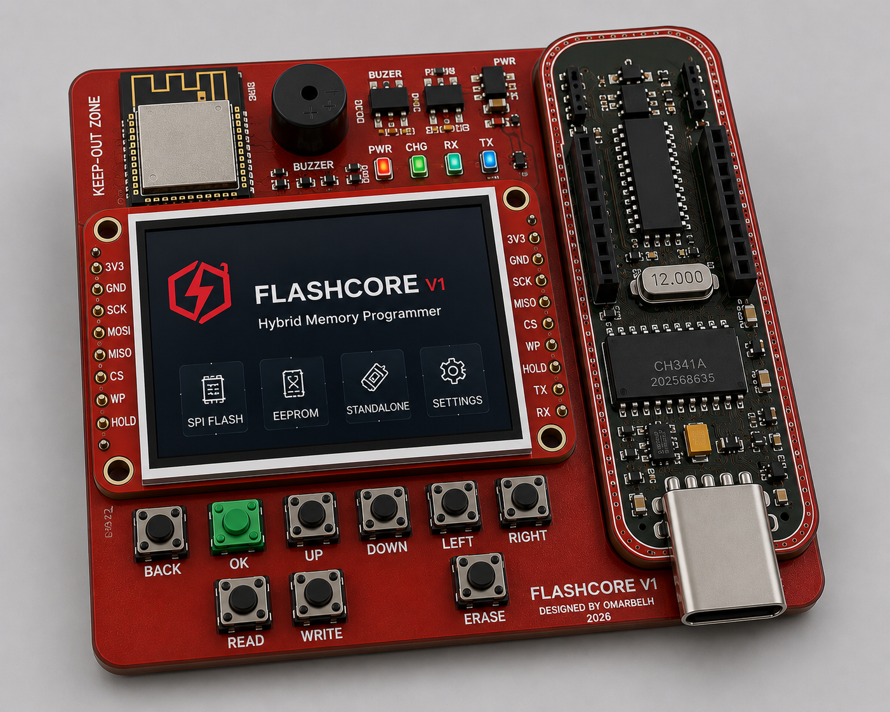
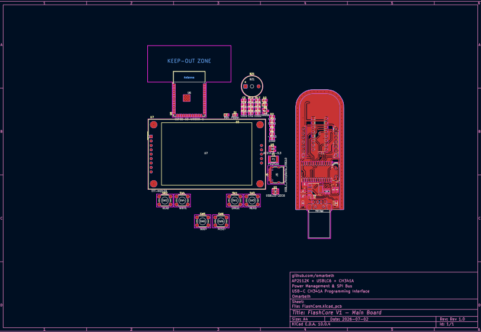
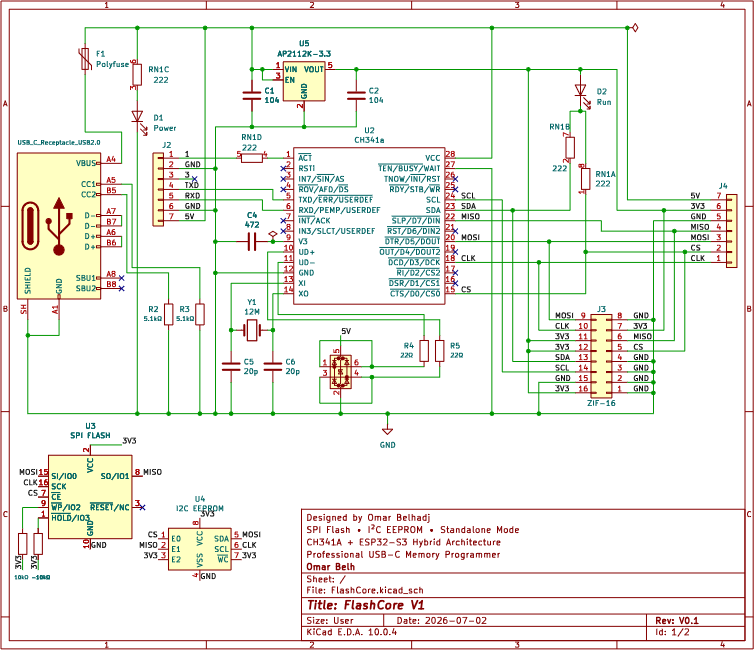
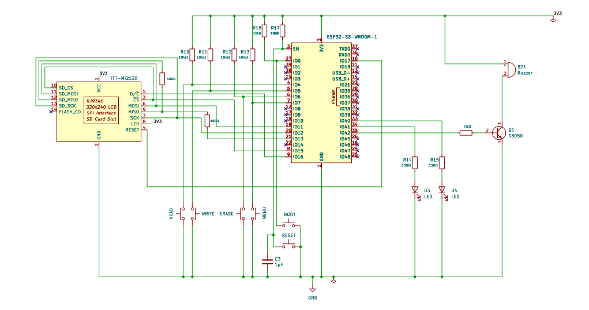

<div align="center">

# ⚡ FlashCore V1

### Hybrid USB-C Memory Programmer
**Powered by CH341A + ESP32-S3**

*A custom hardware programmer designed for learning, development, and future standalone memory programming.*

---



</div>

---

# 📖 About

FlashCore V1 is an open-source hardware project that combines the reliability of the **CH341A USB programmer** with the flexibility of an **ESP32-S3**.

The goal is to create a modern memory programmer that can operate both from a computer and, in future versions, as a standalone device with its own graphical user interface.

This project is also a personal journey to improve my skills in:

- PCB Design
- Embedded Systems
- Hardware Development
- KiCad
- ESP32
- USB Devices
- Memory Technologies

---

# ✨ Current Features

- ✅ USB-C Interface
- ✅ CH341A Programming Circuit
- ✅ ESP32-S3 Controller
- ✅ 320×240 TFT Display
- ✅ Standalone Buttons
- ✅ Status LEDs
- ✅ Buzzer
- ✅ Hybrid Hardware Architecture

---

# 🖼️ Project Images

## PCB Layout



---

## Main Schematic



---

## ESP32 Standalone Controller



---

# 🧩 Hardware

| Component | Description |
|-----------|-------------|
| CH341A | USB Memory Programmer |
| ESP32-S3-WROOM-1 | Standalone Controller |
| AP2112K | 3.3V LDO Regulator |
| USB-C | Power & Data |
| TFT Display | User Interface |
| Push Buttons | Read / Write / Erase / Menu |
| Status LEDs | Power & Status |
| Buzzer | Audio Feedback |

---

# 🚀 Project Status

| Stage | Status |
|--------|--------|
| Concept | ✅ Completed |
| Schematic | ✅ Completed |
| PCB Layout | 🚧 In Progress |
| Prototype | ⏳ Planned |
| Firmware | ⏳ Planned |
| Standalone Mode | ⏳ Planned |

---

# 🛣️ Roadmap

## FlashCore V1

- [x] Schematic Design
- [x] ESP32 Integration
- [x] USB-C Interface
- [ ] PCB Routing
- [ ] Prototype Assembly
- [ ] Hardware Testing

## FlashCore V2

- [ ] 1.8V Support
- [ ] ZIF Socket
- [ ] Automatic Voltage Selection
- [ ] Better User Interface

## FlashCore V3

- [ ] EEPROM Support
- [ ] EPROM Support
- [ ] NAND Flash
- [ ] NOR Flash
- [ ] Standalone Firmware Update

---

# 📂 Repository Structure

```text
FlashCore/
│
├── Hardware/
│   ├── KiCad/
│   ├── PDF/
│   └── Images/
│
├── Firmware/
│
├── Documentation/
│
├── README.md
└── LICENSE
```

---

# 🤝 Contributing

Contributions, suggestions, and ideas are always welcome.

If you find an issue or have an idea for improving FlashCore, feel free to open an Issue or submit a Pull Request.

---

# 📜 License

This project is released under the **MIT License**.

---

<div align="center">

### Designed and Developed by

# Omar Belh

⭐ If you like this project, consider giving it a star!

</div>
